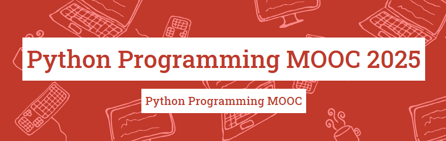

# Python Programming Course 2025

**🇧🇷 Português**

## 📝 Descrição

Este repositório contém as soluções dos exercícios realizados durante o curso Python Programming MOOC 2025 fornecido pela Universidade de Helsinki, Finlândia. O curso aborda desde os conceitos básicos até tópicos mais avançados da linguagem Python.

### 📌 Introdução

| **Partes** | Conteúdo |
|------------|---------------|
| **Parte 1** | Entrada e saída de dados, Operadores atirmáticos, Uso de variáveis e Estruturas condicionais (if-elif-else) |
| **Parte 2** | Terminologias (declarações, blocos, sintaxe, funções, expressões, tipos de dados e depuração), Operadores lógicos e Loop while|
| **Parte 3** | Loop while + varíavel de controle, Manipulação de strings + substrings, Loop com break e continue e Definindo funções |
| **Parte 4** | Listas, Loop for e  Formatação de strings |
| **Parte 5** | Referências de variáveis, Dicionário e Tuplas |
| **Parte 6** | Ler e escrever arquivos, Tratamento de erros e Variáveis locais/globais |
| **Parte 7** | Módulos, Aleatoriedade, Datas e Horários e Processamento de dados

### 📌 Avançado

| **Partes** | Conteúdo |
|------------|---------------|
| **Parte 8** | |
| **Parte 9** | |
| **Parte 10** |  |
| **Parte 11** |  |
| **Parte 12** |  |
| **Parte 13** | |
| **Parte 14** | 

      
**🇺🇸 English**

## 📝 Description

This repository contains the solutions to the exercises carried out during the Python Programming MOOC 2025 course provided by the University of Helsinki, Finland. The course covers everything from basic concepts to more advanced topics in the Python language.

### 📌 Introdução

| **Parts** | Content |
|------------|---------------|
| **Part 1** | Data input and output, Aritmetic operators, Variables and Conditional structures (if-elif-else) |
| **Part 2** | Terminology (declarations, blocks, syntax, functions, expressions, data types and debugging), Logical operators and While loop (boolean)|
| **Part 3** | While loop (with control variable), Break, Continue, String manipulation + substrings and Functions |
| **Part 4** | Lists, For loop and String formatting |
| **Part 5** | Variable references, Dictionary and Tuples |
| **Part 6** | Reading and writing files, Error handling and Local/global variables |
| **Part 7** |  Modules, Randomness, Dates and Times and Data Processing |

### 📌 Advanced

| **Parts** | Content |
|------------|---------------|
| **Part 8** | |
| **Part 9** | |
| **Part 10** |  |
| **Part 11** |  |
| **Part 12** |  |
| **Part 13** | |
| **Part 14** | 
      

